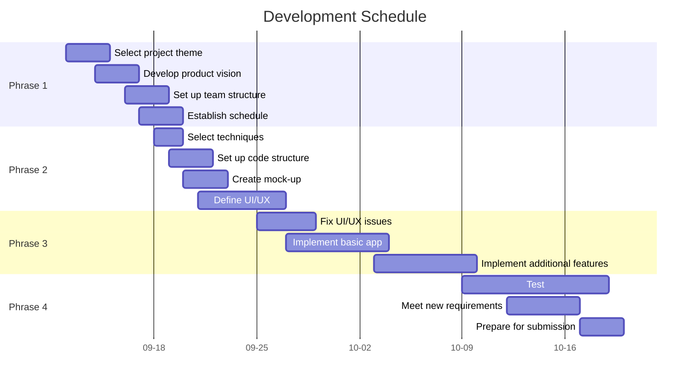

# Project Plan

## Overview

## Product Vision

## Goals & Scope

## Tools and Techniques
- Version control - git
- Project information website - GitLab
- IDE - Android Studio
- Team communication - Microsoft Teams
- SDK/API level - 33
- Data storage - Firebase
......

## Roles
UID|Name|Role|
-|-|-
u|Fiona Chu|
u|Lachlan Scott|
u|Rita Zhou|
u|Yuxuan Zhao|

- product owner
- project manager
- scrum master
- UX & UI designer
- software developer (responsible for [ ] module)
- software tester (responsible for [ ] module)
......

## Schedule
