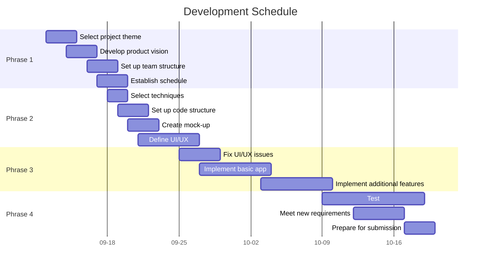

# Project Plan

## Overview
For university students in Canberra who have goods, items, or furniture they would like to sell onwards to other students. The Purple Switch is a marketplace platform that enables university students seeking to recycle or upcycle their pre-loved possessions to fellow students in the community. Unlike competitors, Purple Switch is aimed solely at the user’s university to build and strengthen a community of student recyclers. Our product is locally instantiable by any innovative students in their respective areas.

## Product Vision

## Goals & Scope

## Tools and Techniques
- Version control - git
- Project information website - GitLab
- IDE - Android Studio
- Team communication - Microsoft Teams
- SDK/API level - 33
- Data storage - Firebase
......

## Roles
UID|Name|Role|
-|-|-
u6659041|Fiona Chu|UX & UI designer, product owner
u7577606|Lachlan Scott|scrum master, software developer
u7326123|Rita Zhou|UX & UI designer, software tester
u7366711|Yuxuan Zhao|software developer, software tester

- product owner
- project manager
- scrum master
- UX & UI designer
- software developer (responsible for [ ] module)
- software tester (responsible for [ ] module)
......

## Schedule

