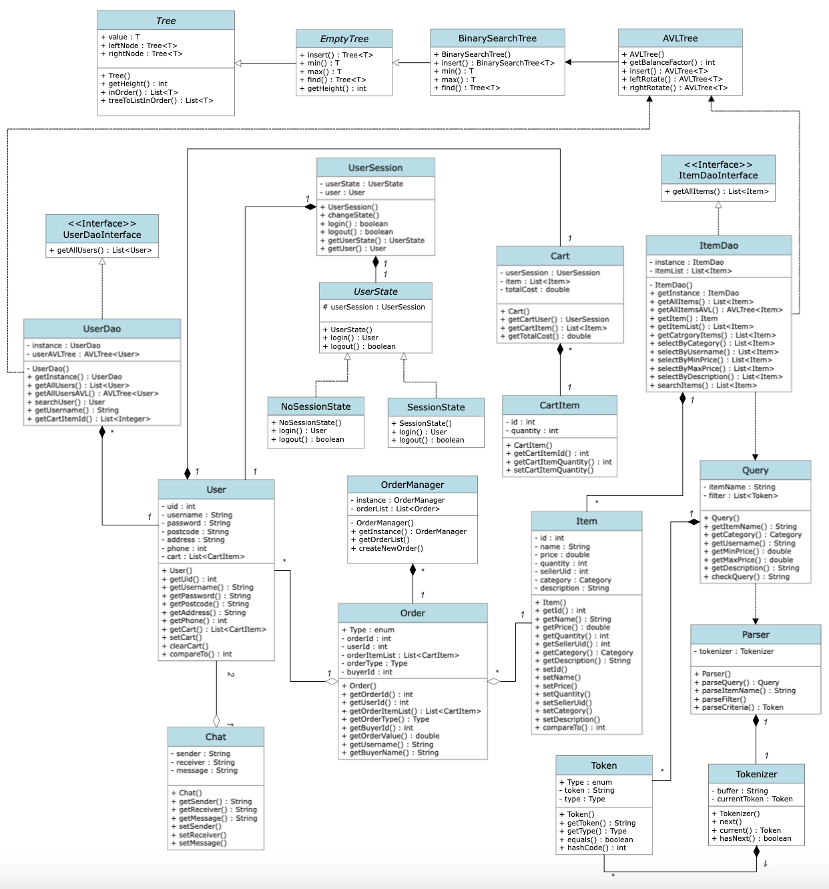

# Purple Switch Report

## Table of Contents

1. [Team Members and Roles](#team-members-and-roles)
2. [Summary of Individual Contributions](#summary-of-individual-contributions)
3. [Conflict Resolution Protocol](#conflict-resolution-protocol)
4. [Application Description](#application-description)
5. [Application UML](#application-uml)
6. [Application Design and Decisions](#application-design-and-decisions)
7. [Summary of Known Errors and Bugs](#summary-of-known-errors-and-bugs)
8. [Testing Summary](#testing-summary)
9. [Implemented Features](#implemented-features)
10. [Team Meetings](#team-meetings)

## Team Members and Roles

| UID | Name | Role |
| :--- | :----: | ---: |
| U7366711 | Yuxuan Zhao | UX & UI designer, software developer, software tester |
| U7326123 | (Rita) Xinyun Zhou | UX & UI designer, software developer, software tester, data manager |
| U6659041 | Fiona Chu | Product owner, meeting minutes scribe |
| U7577606 | Lachlan Scott | Product owner |

## Summary of Individual Contributions

U7366711, Yuxuan Zhao, I contribute % of the project. Here are my contributions:
-	(UI design) Introduce Material Design 3
-	(UI design) [activity_main.xml](https://gitlab.cecs.anu.edu.au/u7577606/ga-22s2-comp2100-6442/-/blob/main/app/src/main/res/layout/activity_main.xml)
-	(UI design) [bottom_navigation_menu.xml](https://gitlab.cecs.anu.edu.au/u7577606/ga-22s2-comp2100-6442/-/blob/main/app/src/main/res/menu/bottom_navigation_menu.xml)
-	(UI design) [fragment_home.xml](https://gitlab.cecs.anu.edu.au/u7577606/ga-22s2-comp2100-6442/-/blob/main/app/src/main/res/layout/fragment_home.xml)
-	(UI design) [fragment_item_list.xml](https://gitlab.cecs.anu.edu.au/u7577606/ga-22s2-comp2100-6442/-/blob/main/app/src/main/res/layout/fragment_item_list.xml)
-	(UI design) [fragment_item_detail.xml](https://gitlab.cecs.anu.edu.au/u7577606/ga-22s2-comp2100-6442/-/blob/main/app/src/main/res/layout/fragment_item_detail.xml)
-	(UI design) [fragment_login.xml](https://gitlab.cecs.anu.edu.au/u7577606/ga-22s2-comp2100-6442/-/blob/main/app/src/main/res/layout/fragment_login.xml)
-	(UI design) [fragment_order_list.xml](https://gitlab.cecs.anu.edu.au/u7577606/ga-22s2-comp2100-6442/-/blob/main/app/src/main/res/layout/fragment_order_list.xml)
-	(UI design) [fragment_person.xml (L6-52)](https://gitlab.cecs.anu.edu.au/u7577606/ga-22s2-comp2100-6442/-/blob/main/app/src/main/res/layout/fragment_person.xml#L6-52)
-	(UI design) [recycler_view_row.xml (L7-56)](https://gitlab.cecs.anu.edu.au/u7577606/ga-22s2-comp2100-6442/-/blob/main/app/src/main/res/layout/recycler_view_row.xml#L7-56)
-	(UI design) [recycler_view_row_order.xml](https://gitlab.cecs.anu.edu.au/u7577606/ga-22s2-comp2100-6442/-/blob/main/app/src/main/res/layout/recycler_view_row_order.xml)
-	(Data) [Icons and avatars](https://gitlab.cecs.anu.edu.au/u7577606/ga-22s2-comp2100-6442/-/tree/main/app/src/main/res/drawable)
-	(Code design) Design patterns: Singleton, State, DAO
-	(Code design) Data structure: AVL Tree
-	(Code implementation) [Read data instances from local files](https://gitlab.cecs.anu.edu.au/u7577606/ga-22s2-comp2100-6442/-/blob/main/app/src/main/java/com/example/mymarketplaceapp/models/UserDao.java#L54-72)
-	(Code implementation) [Item](https://gitlab.cecs.anu.edu.au/u7577606/ga-22s2-comp2100-6442/-/blob/main/app/src/main/java/com/example/mymarketplaceapp/models/Item.java)
-	(Code implementation) [ItemDao](https://gitlab.cecs.anu.edu.au/u7577606/ga-22s2-comp2100-6442/-/blob/main/app/src/main/java/com/example/mymarketplaceapp/models/ItemDao.java)
-	(Code implementation) [User](https://gitlab.cecs.anu.edu.au/u7577606/ga-22s2-comp2100-6442/-/blob/main/app/src/main/java/com/example/mymarketplaceapp/models/User.java)
-	(Code implementation) [UserDao](https://gitlab.cecs.anu.edu.au/u7577606/ga-22s2-comp2100-6442/-/blob/main/app/src/main/java/com/example/mymarketplaceapp/models/UserDao.java)
-	(Code implementation) [UserState](https://gitlab.cecs.anu.edu.au/u7577606/ga-22s2-comp2100-6442/-/blob/main/app/src/main/java/com/example/mymarketplaceapp/models/UserState.java)
-	(Code implementation) [SessionState](https://gitlab.cecs.anu.edu.au/u7577606/ga-22s2-comp2100-6442/-/blob/main/app/src/main/java/com/example/mymarketplaceapp/models/SessionState.java)
-	(Code implementation) [NoSessionState](https://gitlab.cecs.anu.edu.au/u7577606/ga-22s2-comp2100-6442/-/blob/main/app/src/main/java/com/example/mymarketplaceapp/models/NoSessionState.java)
-	(Code implementation) [UserSession](https://gitlab.cecs.anu.edu.au/u7577606/ga-22s2-comp2100-6442/-/blob/main/app/src/main/java/com/example/mymarketplaceapp/models/UserSession.java)
-	(Code implementation) [Order](https://gitlab.cecs.anu.edu.au/u7577606/ga-22s2-comp2100-6442/-/blob/main/app/src/main/java/com/example/mymarketplaceapp/models/Order.java)
-	(Code implementation) [OrderManager](https://gitlab.cecs.anu.edu.au/u7577606/ga-22s2-comp2100-6442/-/blob/main/app/src/main/java/com/example/mymarketplaceapp/models/OrderManager.java)
-	(Code implementation) [AVLTree (based on lab code)](https://gitlab.cecs.anu.edu.au/u7577606/ga-22s2-comp2100-6442/-/blob/main/app/src/main/java/com/example/mymarketplaceapp/utils/AVLTree.java)
-	(Code implementation) [Token](https://gitlab.cecs.anu.edu.au/u7577606/ga-22s2-comp2100-6442/-/blob/main/app/src/main/java/com/example/mymarketplaceapp/utils/Token.java)
-	(Code implementation) [Tokenizer](https://gitlab.cecs.anu.edu.au/u7577606/ga-22s2-comp2100-6442/-/blob/main/app/src/main/java/com/example/mymarketplaceapp/utils/Tokenizer.java)
-	(Code implementation) [Parser](https://gitlab.cecs.anu.edu.au/u7577606/ga-22s2-comp2100-6442/-/blob/main/app/src/main/java/com/example/mymarketplaceapp/utils/Parser.java)
-	(Code implementation) [Query](https://gitlab.cecs.anu.edu.au/u7577606/ga-22s2-comp2100-6442/-/blob/main/app/src/main/java/com/example/mymarketplaceapp/utils/Query.java)
-	(Code implementation) [ContextUtil](https://gitlab.cecs.anu.edu.au/u7577606/ga-22s2-comp2100-6442/-/blob/main/app/src/main/java/com/example/mymarketplaceapp/utils/ContextUtil.java)
-	(Code implementation) [RecyclerViewAdapter (L31-79)](https://gitlab.cecs.anu.edu.au/u7577606/ga-22s2-comp2100-6442/-/blob/main/app/src/main/java/com/example/mymarketplaceapp/adapters/RecyclerViewAdapter.java#L31-79)
-	(Code implementation) [OrderRecyclerViewAdapter](https://gitlab.cecs.anu.edu.au/u7577606/ga-22s2-comp2100-6442/-/blob/main/app/src/main/java/com/example/mymarketplaceapp/adapters/OrderRecyclerViewAdapter.java)
-	(Code implementation) [HomeFragment](https://gitlab.cecs.anu.edu.au/u7577606/ga-22s2-comp2100-6442/-/blob/main/app/src/main/java/com/example/mymarketplaceapp/fragments/HomeFragment.java)
-	(Code implementation) [ItemListFragment (L35-86)](https://gitlab.cecs.anu.edu.au/u7577606/ga-22s2-comp2100-6442/-/blob/main/app/src/main/java/com/example/mymarketplaceapp/fragments/ItemListFragment.java#L35-86)
-	(Code implementation) [ItemDetailFragment (L32-76)](https://gitlab.cecs.anu.edu.au/u7577606/ga-22s2-comp2100-6442/-/blob/main/app/src/main/java/com/example/mymarketplaceapp/fragments/ItemDetailFragment.java#L32-76)
-	(Code implementation) [LoginFragement](https://gitlab.cecs.anu.edu.au/u7577606/ga-22s2-comp2100-6442/-/blob/main/app/src/main/java/com/example/mymarketplaceapp/fragments/LoginFragment.java)
-	(Code implementation) [OrderListFragment](https://gitlab.cecs.anu.edu.au/u7577606/ga-22s2-comp2100-6442/-/blob/main/app/src/main/java/com/example/mymarketplaceapp/fragments/OrderListFragment.java)
-	(Code implementation) [PersonFragment (L26-54)](https://gitlab.cecs.anu.edu.au/u7577606/ga-22s2-comp2100-6442/-/blob/main/app/src/main/java/com/example/mymarketplaceapp/fragments/PersonFragment.java#L26-54)
-	(Code implementation) [ParserTest](https://gitlab.cecs.anu.edu.au/u7577606/ga-22s2-comp2100-6442/-/blob/main/app/src/test/java/com/example/mymarketplaceapp/utils/ParserTest.java)
-	(Code implementation) [TokenizerTest](https://gitlab.cecs.anu.edu.au/u7577606/ga-22s2-comp2100-6442/-/blob/main/app/src/test/java/com/example/mymarketplaceapp/utils/TokenizerTest.java)
-	(Items) [protocol.md (organized into .md)](https://gitlab.cecs.anu.edu.au/u7577606/ga-22s2-comp2100-6442/-/blob/main/items/protocol.md)
-	(Items) [plan.md (organized into .md)](https://gitlab.cecs.anu.edu.au/u7577606/ga-22s2-comp2100-6442/-/blob/main/items/plan.md)
-	(Others) Determine directory structure and naming convention
-	(Others) Attend every meeting
-	(Report writing)
-	(Slide presentation)

## Conflict Resolution Protocol

[Conflict Resolution Protocol](https://gitlab.cecs.anu.edu.au/u7577606/ga-22s2-comp2100-6442/-/blob/main/items/protocol.md)

## Application Description

Our marketplace app is a consumer-to-consumer based platform targeting individuals who want to sell their personal items quickly and simply. As a buyer, our app allows users to search and filter listed items, buy multiple items at once with a cart, create a user account to save their information, and facilitates the payment process by confirming transactions and providing receipts. As a seller, our app allows user to list items, and provides tools to help with the selling process such as chats between the seller and potential buyers, and notifications for sellers once their items have been sold.     

### Application use cases and examples 
**Target Users:**

- Those who want an easy way to find second hand items or items from other people being sold online. 
- Those who wish to sell their personal items quickly and simply. 

**Example 1: A student wants to buy a second-hand lamp for their room.**  

1. They open the app and select the ‘Electronics’ category 
2. They sort by low to high price, as they don’t want to spend too much on the item. 
3. After looking at the item page and deciding to buy, they add it to their cart. 
4. The app takes them through the checkout process, confirms their payment and notifies the seller. 

**Example 2: Sally wants to sell some clothes that don’t fit her.**

1. Sally opens the app and makes an account. 
2. They list their items. 
3. A potential buyer is interested but is unsure if the sizing is correct. They message the seller asking for the garment measurements.  
4. Sally responds with the measurements. 
5. The buyer is happy with the measurements and adds the clothes to their cart. 
6. The buyer pays for the clothes and Sally sends them. 

**Example 3: Emily wants to repurchase some snacks from a seller that they liked.** 

1. She logs in to her account on the app and goes to her purchase history. 
1. She quickly finds the snacks that she purchased and adds them to her cart again from their item pages. 
1. She goes through the checkout process and buys the snacks. 

**Example 4: Ashley wants to buy a textbook for her course second-hand.**
1. She searches for the name of the textbook. 
1. After finding the correct textbook, she adds it to her cart and tries to purchase it. 
1. Unfortunately, the textbook is very popular and another student has managed to purchase it before she could. 
1. Ashley gets a message from the app that the textbook in her cart has sold out.  
1. Ashley goes back to searching for her textbook. 

## Application UML

  

[UML Class Diagram @smartdraw](https://cloud.smartdraw.com/share.aspx/?pubDocShare=4D5A08F649B156CCAA852F5A988AD8839F3)

## Application Design and Decisions

**Data Structures**

1. ArrayList
   - Objective: It is used for storing small, infrequently accessed data.
   - Location: [Cart](https://gitlab.cecs.anu.edu.au/u7577606/ga-22s2-comp2100-6442/-/blob/main/app/src/main/java/com/example/mymarketplaceapp/models/Cart.java#L15),  [Query](https://gitlab.cecs.anu.edu.au/u7577606/ga-22s2-comp2100-6442/-/blob/main/app/src/main/java/com/example/mymarketplaceapp/utils/Query.java#L30) etc.
   - Reasons:
      - ArrayList is easy to use and reliable
      - In these features, we do not need to search or sort elements

2. AVL Tree
   - Objective: It is used for storing items and users.
   - Location: [UserDAO](https://gitlab.cecs.anu.edu.au/u7577606/ga-22s2-comp2100-6442/-/blob/main/app/src/main/java/com/example/mymarketplaceapp/models/UserDao.java#L79-123),  [ItemDAO](https://gitlab.cecs.anu.edu.au/u7577606/ga-22s2-comp2100-6442/-/blob/main/app/src/main/java/com/example/mymarketplaceapp/models/ItemDao.java#L77-104)
   - Reasons:
      - We need to search and sort users and products frequently, and AVL Tree is more efficient than Arraylist
      - Mobile apps are unlikely to run on hard disk drive, so B-tree has no advantage over AVL tree here
      - We do not implement the feature of deleting items and users, so Red-Black Tree has little advantage over AVL tree here

**Design Patterns**

1. DAO (Data Access Object)
   - Objective: It is used to read data without exposing details of the data storage (`json` or `Firebase`).
   - Location: [UserDAO](https://gitlab.cecs.anu.edu.au/u7577606/ga-22s2-comp2100-6442/-/blob/main/app/src/main/java/com/example/mymarketplaceapp/models/UserDao.java),  [ItemDAO](https://gitlab.cecs.anu.edu.au/u7577606/ga-22s2-comp2100-6442/-/blob/main/app/src/main/java/com/example/mymarketplaceapp/models/ItemDao.java)
   - Reasons:
      - We started by reading data from json, and considering that we would have to implement reading data from Firebase later
      - We need to decouple the front end from the data source

2. State
   - Objective: It is used for defining the different state of user, and user will have different action in different state .
   - Location: [UserSession](https://gitlab.cecs.anu.edu.au/u7577606/ga-22s2-comp2100-6442/-/blob/main/app/src/main/java/com/example/mymarketplaceapp/models/UserSession.java), [UserState](https://gitlab.cecs.anu.edu.au/u7577606/ga-22s2-comp2100-6442/-/blob/main/app/src/main/java/com/example/mymarketplaceapp/models/UserState.java), [SessionState](https://gitlab.cecs.anu.edu.au/u7577606/ga-22s2-comp2100-6442/-/blob/main/app/src/main/java/com/example/mymarketplaceapp/models/SessionState.java), [NoSessionState](https://gitlab.cecs.anu.edu.au/u7577606/ga-22s2-comp2100-6442/-/blob/main/app/src/main/java/com/example/mymarketplaceapp/models/NoSessionState.java)
   - Reasons:
      - Using State design pattern, rather than conditional statements, improves the readability of the code
      - Facilitate the subsequent addition of more account statuses (e.g. `banned` for suspected fraud)

3. Singleton
   - Objective: It is used to ensure that a class (e.g. `OrderManager`) has just a single instance.
   - Location: [OrderManager](https://gitlab.cecs.anu.edu.au/u7577606/ga-22s2-comp2100-6442/-/blob/main/app/src/main/java/com/example/mymarketplaceapp/models/OrderManager.java), [UserDAO](https://gitlab.cecs.anu.edu.au/u7577606/ga-22s2-comp2100-6442/-/blob/main/app/src/main/java/com/example/mymarketplaceapp/models/UserDao.java),  [ItemDAO](https://gitlab.cecs.anu.edu.au/u7577606/ga-22s2-comp2100-6442/-/blob/main/app/src/main/java/com/example/mymarketplaceapp/models/ItemDao.java)
   - Reasons:
      - To control access to the shared resources (`item.json`,`user.json` and `Firebase` )
      - Provide a global access point to the `OrderManager` and DAOs

**Grammar(s)**

Production Rules:
    
    <query>    ::= <item name> | <item name> <filter>
    <filter>   ::= <criteria> | <criteria> <filter>
    <criteria> ::= <category> | <user name> | <minimum price> | <maximum price> | <description>
    
Unlike mathematical expressions, the search queries in shopping apps do not require the use of binary operator. Users should be allowed to simply indicate different filter criteria using different symbols. The grammar and symbols should be as intuitive as possible to the users.

Location: [Parser](https://gitlab.cecs.anu.edu.au/u7577606/ga-22s2-comp2100-6442/-/blob/main/app/src/main/java/com/example/mymarketplaceapp/utils/Parser.java)

Example:
- Original query:`uPhone #ELECTRONICS @JB Wi-Fi >1024 <2048 ^bullet-proof`
- Meaning: Search in `ELECTRONICS` category for items with `uPhone` in the item name of which the seller is named `JB Wi-Fi`, the price is between `1024` and `2048`, and the description includes `bullet-proof`

Advantages:
- The grammar can satisfy most of the users' search needs
- The grammar is very intuitive
- It is convenient to design a parser for such a grammar
- The grammar makes it easier to handle illegal input

**Tokenizer and Parsers**

Location: [Parser](https://gitlab.cecs.anu.edu.au/u7577606/ga-22s2-comp2100-6442/-/blob/main/app/src/main/java/com/example/mymarketplaceapp/utils/Parser.java), [Tokenizer](https://gitlab.cecs.anu.edu.au/u7577606/ga-22s2-comp2100-6442/-/blob/main/app/src/main/java/com/example/mymarketplaceapp/utils/Tokenizer.java), [Token](https://gitlab.cecs.anu.edu.au/u7577606/ga-22s2-comp2100-6442/-/blob/main/app/src/main/java/com/example/mymarketplaceapp/utils/Token.java)

We use `Parser` to parse the text in search box into `Query`. A successfully parsed `Query` instance consists of a `String itemName` (mandatory) and a `List<Token> filter` (optional). A `filter` consists of several criteria (`Token`). A `Token` instance consists of `String token` and `Type type`.

|Token.Type|Symbol|
-|-
ITEM_NAME|
CATEGORY|#
USERNAME|@
MIN_PRICE|>
MAX_PRICE|<
DESCRIPTION|^

Advantages:
- Token identifiers are very intuitive to the user and at the same time rarely used in item names and descriptions
- Parser and Tokenizer are both highly readable, maintainable and extensible

**Other**

We are very hesitant about using Firebase or using a local database (JSON). Finally, we decided to store the user and item in the JSON file and store the messages in Firebase. We made this decision because we define some values of integers and doubles in the User Class and Item Class at the start of our project. In particular, we set the User uid and the Item id as integers. These two values are the primary key that we often use. This leads us to use Integer.parseInt() or String.valueOf() frequently if we are using Firebase. However, if we use a JSON file, we can use [gson](https://github.com/google/gson) to read data. So we decide to use JSON to store the data of the Item and the User. We decided to use Firebase to store messages because our teammate Rita used Firebase to read and store data when she first implemented the functionality of messages. And the message is independent of other functions, so we don't need to convert between String and Integer many times. Thus, we chose to use Firebase to save the message.

We draw a [diagram](./COMP21006442_GROUP_PROJECT_PLANNING.pdf) for how our app looks like and the connection between pages. Comparing what we have for the app, we can say that out final product is different with our planning. 

The biggest reason for us to change our plan is we don’t have enough time to implement the app that we planned. We planning to have a selling page, but we realise that we won’t have enough to implement the features, so we decide to make the selling page to be a page showing the order. We give up the register as well as we realize that the register is not compulsory for the login feature. We decide to remove the login button on the page that tells the user should log in. Because the app will clash with icons on the navigation bar. We decide to add one item to the cart and change the quantity on the cart. Because we think that the user should pay on the cart page, and they will change the quantity at that time. 

## Summary of Known Errors and Bugs

*[Where are the known errors and bugs? What consequences might they lead to?]*

*Here is an example:*

1. *Bug 1:*

- *A space bar (' ') in the sign in email will crash the application.*
- ...

2. *Bug 2:*
3. ...

*List all the known errors and bugs here. If we find bugs/errors that your team does not know of, it shows that your testing is not thorough.*

## Testing Summary
**Feature-oriented**

We tested login feature (Feature 1). We tested by using the correct username and correct password, correct username and incorrect password, incorrect username and random password. We also tested blank input. 

To test load data feature (Feature 3), we created only 10 data instances in the user.json and item.json files. And we check if all data is loaded to the app. 

We tested search feature (Feature 4). 

We tested search invalid input feature (Feature 5). The invalid input will show up a toast to tell the user that the input is invalid.

We tested sorted feature (Feature 6). We checked that the item would sort in price in item list page.

We tested the feature of classify the items (Feature 7).

We tested when we click the different icons, the item list will show the items in a different category.

We tested the user profile image feature (Feature 8). We tested that every user has a different profile photo.

We tested the add to cart feature (Feature 9). We tested after we click the add button on the item detail page, the item will show on the cart. We tested add the item which is already in cart will show a toast to tell the user that this action is fail. We tested the toast will show to user if the item is out of stock.

We tested transfer the resources (Feature 10). We tested the stock of item will decrease after the item is sold. (To find the maximum of stock, you can add the item to the cart and click the plus button until the toast show)
We tested log transfer (Feature 11). After the payment finish, the buyer will get a new receipt on the order page shown as “buy”. The seller will get a log on the order page shown as “sell”.

We tested peer-to-peer feature (Feature 12). We tested the sending message and reading message. We login to the user account called ‘admin’ and send a message to ‘comp2100@anu.au’. We checked the message is send successfully to the ‘comp2100@anu.au’. The message should place on the right-hand side of view. We checked the Firebase to make sure that the message is uploaded. Then we logout of the ‘admin’ account and login to the ‘comp2100@anu.au’. We checked that we could receive the message from the ‘admin’. And the message from ‘admin’ will be shown on the left-hand side of view. 

**Unit Test**

Given that it is difficult to test Parser and Tokenizer manually, we wrote [TokenizerTest](https://gitlab.cecs.anu.edu.au/u7577606/ga-22s2-comp2100-6442/-/blob/main/app/src/test/java/com/example/mymarketplaceapp/utils/TokenizerTest.java) and [ParserTest](https://gitlab.cecs.anu.edu.au/u7577606/ga-22s2-comp2100-6442/-/blob/main/app/src/test/java/com/example/mymarketplaceapp/utils/ParserTest.java).

**Other**

In our local database (user.json and item.json), we set up some test cases to help us test our app is working correctly.

We are using the user.json to test the cart page is working correctly. 

- We tested if the cart page is work when the user doesn’t have anything in cart (user uid=2). 
- We tested if the user would show their own cart.
- We tested the view of item list looks good in the cart page.
- We tested if the different user could have the same item with different quantity in the cart (user uid=0 and user uid=3). 
- We tested if the user can add the item with same name and same quantity but different id in the cart (user uid=4).
- We tested if the payment in cart will success if the user has an item is out of stock (user uid=5).

We are using the item.json to test the item list page and the item detail page is working correctly. 

- We tested the view of itme list looks good.
- We tested the item detail page is showing the correct item’s detail. 
- We tested the item can’t add into cart if this item is out of stock. We tested the item can show a correct detail even if they are using the same name and same seller but different id (item id=0, id=1). 
- We tested the item with same name, but the different seller and different id can be show on the item list. We tested if the item with stock of 0 can show on the item list.

## Implemented Features

*[What features have you implemented?]*

*Here are some examples:*

Feature Category: Privacy  
*Implemented features:*
1. Feature 1: **Users may ... . (easy)**
   * Class X, methods Z, Y, Lines of code: 10-100
   * Class Y, methods K, L, M, Lines of code: 35-150
   * Your description: ...
 
2. Feature 2: **A user can only ... . (medium)**
 

Feature Category: Firebase Integration  
*Implemented features:*  
1. **Use Firebase to implement user Authentication/Authorisation. (easy)**
   * Class A: methods A, B, C, lines of code: whole file
   * …

*List all features you have completed in their separate categories with their difficulty classification. If they are features that are suggested and approved, please state this somewhere as well.*

## Team Meetings

- [Team Meeting 1](./06_09_2022_Meeting_Minutes.md) (The original document of this minutes was uploaded to the project's [Wiki](https://gitlab.cecs.anu.edu.au/u7577606/ga-22s2-comp2100-6442/-/wikis/Sprint-0), where you can see when it was first uploaded)
- [Team Meeting 2](./15_10_22_Meeting_Minutes.md)
- [Team Meeting 3](./17_10_22_Meeting_Minutes.md)
- [Team Meeting 4](./19_10_2022_Meeting_Minutes.md)
- [Team Meeting 5](./20_10_22_Meeting_Minutes.md)
